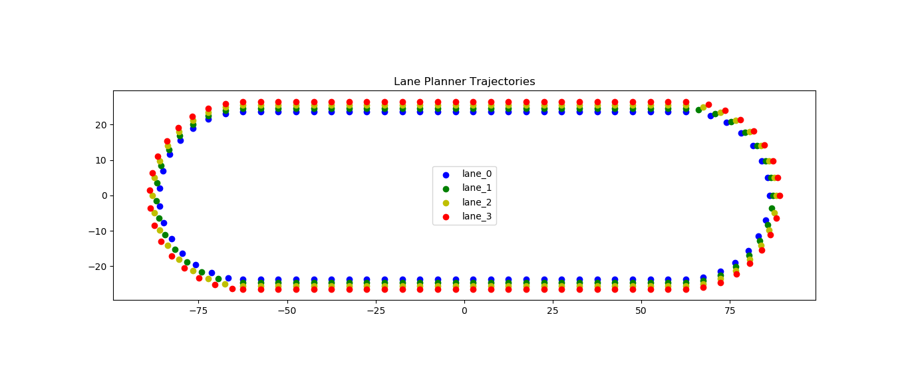

# Group 8 Project

## Sub Modules

| Name                                                 | Description                   | Authors                                                          |
| ---------------------------------------------------- | ----------------------------- | ---------------------------------------------------------------- |
| [lane_planner](lane_planner)                         | Control Logic                 | Johann Erhard, Sebastian Siegner, Chieh Lin                      |
| [lane_planner_bringup](lane_planner_bringup)         | Demo Configurations           | Johann Erhard, Chieh Lin                                         |
| [lane_planner_environment](lane_planner_environment) | Environment and Simulation    | Fabian Zillenbiller, Chieh Lin                                   |
| [lane_planner_helpers](lane_planner_helpers)         | Additional Simulation/Testing | Fabian Zillenbiller, Johann Erhard, Sebastian Siegner, Chieh Lin |

## Project Overview

This project is based on the robot provided by the **tas_sim** package. It implements a custom environment in which lane-changing maneuvers can be simulated using local MPC behavior. For this purpose, we provide a custom environment and obstacle simulation by **lane_planner_environment**. Lane changing behavior and decision making is provided by **lane_planner**. Finally, demonstration configurations and their affiliated launch files are provided by **lane_planner_bringup**. For more information on the following package descriptions, please visit their individual README file as seen above.

### Environment

* A custom Gazebo environment is created
* Trajectories (Points for the car to follow as seen below) are generated to fit the gazebo environment
* A map for **Localization and Mapping** is created to fit the gazebo environment
* Dynamic Obstacle Simulation: Reads trajectories from **Parameter Server** and creates static and dynamic obstacles based on a demonstration mode
* Localization and Navigation: The SLAM and navigation pipeline is configured which is used by **move_base** to navigate the car through the environment

### Control Logic

* The **Laser Checker** node computes zone occupations relative to the robot's position based on LIDAR scans
* The zone occupation is then visualized by the **Zone Visualizer** node which can be seen in RVIZ in real-time (**Red**: Zone is occupied, **Blue**: Zone is un-occupied, Angle of front zones changes based on lane curvature)
* Based on robot position/orientation, trajectory locations, and **move_base_simple/goal**, **lane_planner/LaneGlobalPlanner** creates a **Global Plan** for the robot to follow using **Path Interpolation** as seen below
* Based on zone occupations from **Laser Checker**, the **lane_planner/LaneGlobalPlanner** dynamically redefines the **Global Plan**
* The **Global Plan** is then handled by the **base_local_planner/MpcLocalPlannerROS** to ensure path following behavior: **Local Plan**

