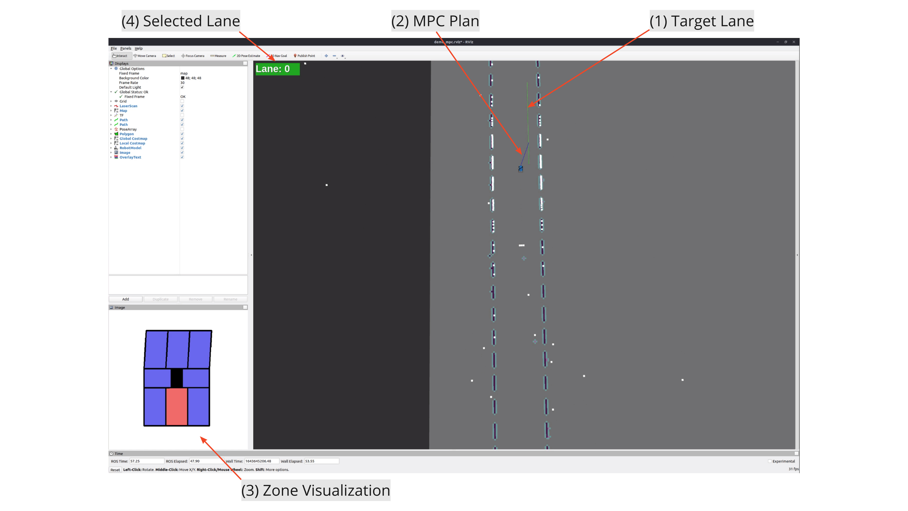
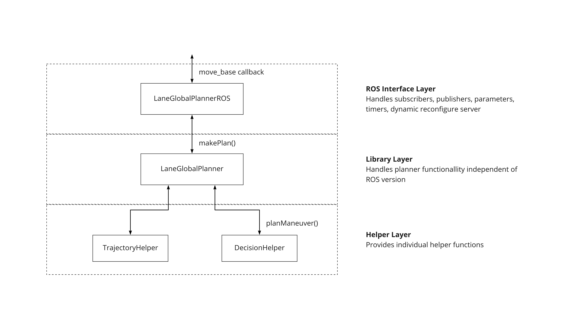
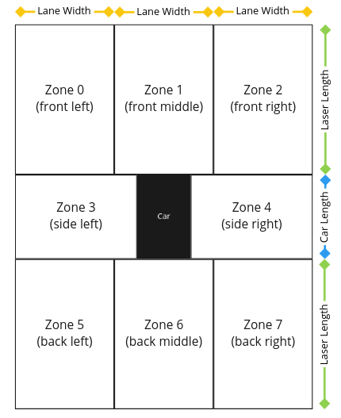
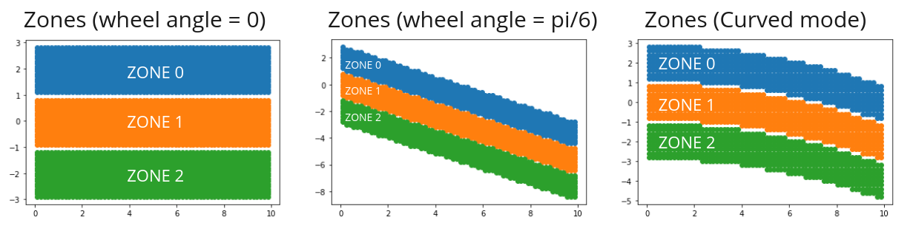
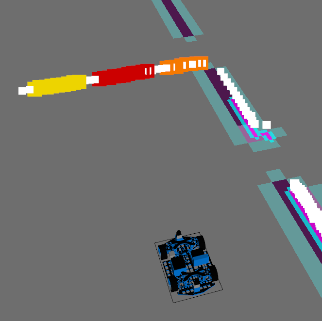

# Lane Planner

This package provides the main planner functionality, i.e., compute and visualize lidar zones, decision making, and `Global Planner` behavior. 

## Contributions to this Package

| Name     | Tasks                 |
| -------- | --------------------- |
| Johann Erhard | <ul><li>Configure and maintain package structure ([CMakeLists.xml](CMakeLists.txt), [package.xml](package.xml), [lane_planner_plugin.xml](lane_planner_plugin.xml))</li><li>Create **lane_planner/LaneGlobalPlanner** plugin (Custom **Global Planner**)</li><li>Create unit tests for library/helper layer of **lane_planner/LaneGlobalPlanner**</li></ul> |
| Sebastian Siegner | <ul><li>Create [Lidar Zone Filter](scripts/LaserChecker.py)</li><li>Provide [Decision Making](src/lib/decision_helper.cpp) in **lane_planner/LaneGlobalPlanner**</li><li>Create custom message [car_scan](msg/Car_scan.msg)</li></ul> |
| Chieh Lin |  <ul><li>Create [Zone Visualization](scripts/ZoneVisualisation.py)</li></ul> |

### Doxygen

C++ code documentation can be generated using the following command. 

* Install Doxygen: [Doxygen Ubuntu Wiki](https://wiki.ubuntuusers.de/Doxygen/)

```shell
sudo apt-get install doxygen
```

* Generate documentation: Output is generated in `doc/html/index.html`

```shell
doxygen Doxyfile
```


## RVIZ Screenshot

The following screenshot shows the RVIZ **Visualization** during **Path Planning**. 

1. Target lane is generated by **lane_planner/LaneGlobalPlanner**
2. **Local MPC Plan** is generated by **base_local_planner/MpcLocalPlannerROS**
3. Zone occupation relative to car is calculated in **Laser Checker** and visualized in **Zone Visualizer**
4. Selected lane overlay is published by **lane_planner/LaneGlobalPlanner**



## Lane Global Planner Plugin

For achieving lane following behavior, we implemented a custom **Global Planner** plugin called **lane_planner/LaneGlobalPlanner**. It is structured into three independent layers providing functional separation and independence of ROS version for some classes. This new Global Planner is activated in **move_base.launch**. It depends on global trajectories which are read over the **Parameter Server** that are provided by the **lane_planner_environment** package. When publishing **/move_base_simple/goal**, a new plan is created that is then followed using the **MpcLocalPlannerROS**. While running at **planner_frequency**, updates from **Laser Checker** are processed and the plan is updated dynamically. The usage can be tuned by changing the parameters in [lane_global_planner_params.yaml](config/lane_global_planner_params.yaml) and using **Dynamic Reconfigure**.



### Lane Global Planner ROS

* Files: [header](include/lane_planner/lane_global_planner_ros.h), [source](src/lane_global_planner_ros.cpp)

The ROS-dependent layer provides all functionality critically to the current ROS version of **noetic**. Parameters are read over the **Parameter Server**, publishers and subscribers are configured to allow for dynamic overlays and feedback, and **Dynamic Reconfigure** as well as Timers, are set up. This class also provides the first **Callback** from **move_base** to create a new **Global Plan**. The next layer is created as a **unique_ptr** and called in the **makePlan() Callback** which actually handles the functionality.

### Lane Global Planner

* Files: [header](include/lane_planner/lane_global_planner.h), [source](src/lib/lane_global_planner.cpp)

The library layer provides the actual **Global Plan** behavior. Whenever the **makePlan() Callback** is called it creates a new or updates an existing/running plan based on a **State Machine**. For ROS-dependent tasks, custom **Callbacks** are registered to allow handing over events to **Lane Global Planner ROS**. For handling trajectories and decision making it uses the **Helper Modules**.

### Trajectory Helper

* Files: [header](include/lane_planner/trajectory_helper.h), [source](src/lib/trajectory_helper.cpp)
* Simulate Interpolation: [jupyter nodebook](../lane_planner_helpers/trajectory_simulation/interpolation_methods.ipynb)
* Simulate Neighbor Trajectory: [jupyter nodebook](../lane_planner_helpers/trajectory_simulation/trajectory_intersection.ipynb)
* Unit Tests: [cpp module 1](test/trajectory_environment/tests.cpp), [cpp module 2](test/trajectory_helper/tests.cpp)

Trajectory helper provides all functionality dependent on trajectories, i.e., **search algorithms**, **selecting optimal trajectory**, **finding neighbor trajectories**, **trajectory Interpolation** (Linear, Catmull, Hermite), and **creating the actual plan**. These functions are extensively tested with custom **Unit Tests** found in [test](test), using custom testing-trajectories and the ones created by the **lane_planner_environment** package.

### Decision Helper

* Files: [header](include/lane_planner/decision_helper.h), [source](src/lib/decision_helper.cpp)

The decision helper provides a function that returns a maneuver that the car should execute. It is based on the current lane and the zone array generated by the LaserChecker.
There are two different decision modes available:
- `Mode 0`: American set of rules for driving
- `Mode 1`: Car tries to stay on the right side 

### Known Bugs

If **base_local_planner/MpcLocalPlannerROS** creates bad **Local Plans** regularily, a possible quick fix could be to revert to simpler **Trajectory Interpolation**. This can be done in [lane_global_planner_params.yaml](config/lane_global_planner_params.yaml#L25) to `interpolation_method: 0` and reduce the size of `interpolation_steps` in [lane_global_planner_params.yaml](config/lane_global_planner_params.yaml#L24). However, most times the issue was resolved after restarting the simulation.

## Laser Checker
To analyze the LIDAR scan done by the two laser scanners on the TAS car, we developed the [LaserChecker.py](scripts/LaserChecker.py). It uses the merged point cloud ("/cloud_merged") from both scanners and maps them into 8 zones surrounding the car.

The zones are mapped like this and generaly follow the lanes of the road:



The node determines how many points are in any given zone. If this value is bigger than a certain threshold, the zone is marked as occupied. This information is then sent to the global planner and the Zone Visualisation using the rostopic "\is_car" with the custom message type [Car_scan.msg](msg/Car_scan.msg).

### Shape of the zones
While the zones on the back and side are always shaped like a rectangle, the zones in the front (zone 0, 1, and 2) can change their shape and position based on the angle of the wheel. This makes the mapping more precise if the lane is curved or during lane changing. 
The front zones can either be polygons or sections of a circle. While the polygons are used on straight lines the sections are used for the curves on our test track. 



Every time the car crosses one of these points it is determined if it is in a corner and in which direction the corner goes, based on its coordinates on the map. This info is used for the curvature of the zones at the front.

### Visulaization in Rviz 
The node also publishes pointclouds of the points in zone 0 to 2 so they can be visualized in RViz. This looks like this:



Besides that it is also visulaized by the ZoneVisalizer.py (see section below)

### Configuration
The node can be configured using the [laser_checker_params.yaml](config/laser_checker_params.yaml)

## Zone Visulization


In order to visualize the Laser Checker, we came up with an implementation with OpenCV. First, we take the two parameters zones and angles from `Car_scan.msg` into consideration. Zones is a boolean array that consists of 8 boolean values.

As seen in the Laser Checker description above, there are 8 zones from the laser checker. If any obstacle is detected in a zone, we would get a true value according to the element in the zone array. 

What we do next is to create rectangles and polygons for each zones. What’s worth mentioning is specifically zone 0/1/2, we implement a polygon for these zones if the wheels are turned, the polygons are angled accordingly to the angle value. Furthermore, we set the zones to red if we detect obstacles in the zone, and blue if there are no obstacles.

All rectangles and polygons are done with openCV via `cv2.rectangle`, `cv2.fillPoly`, `cv2.polylines`.
