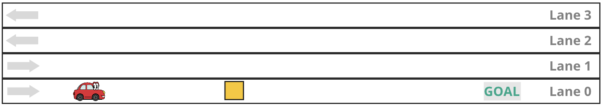
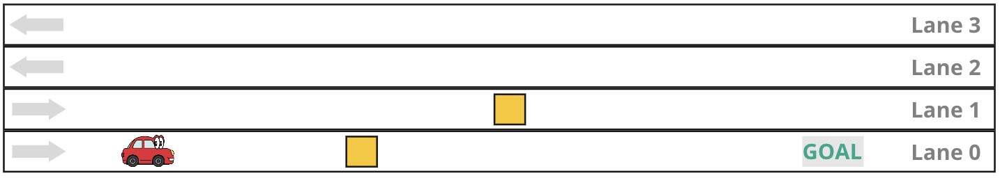
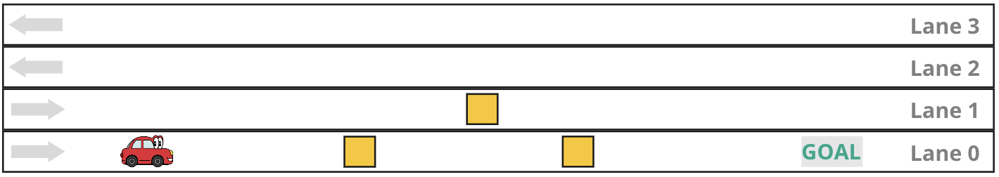
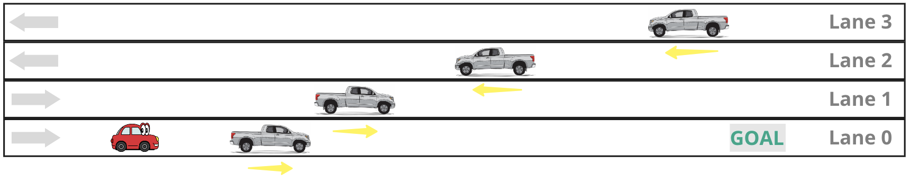
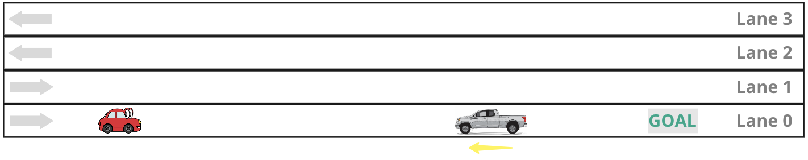
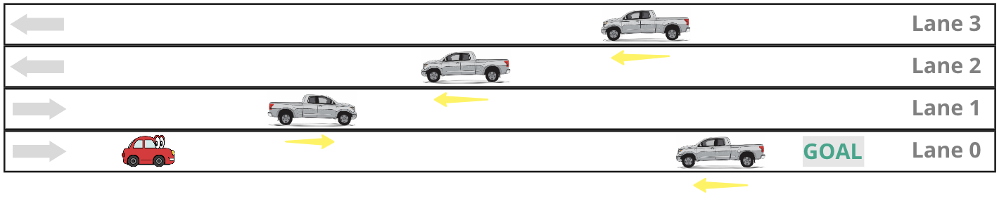
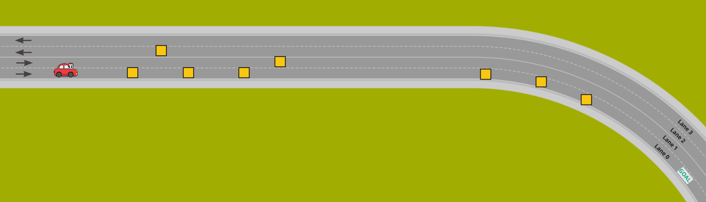
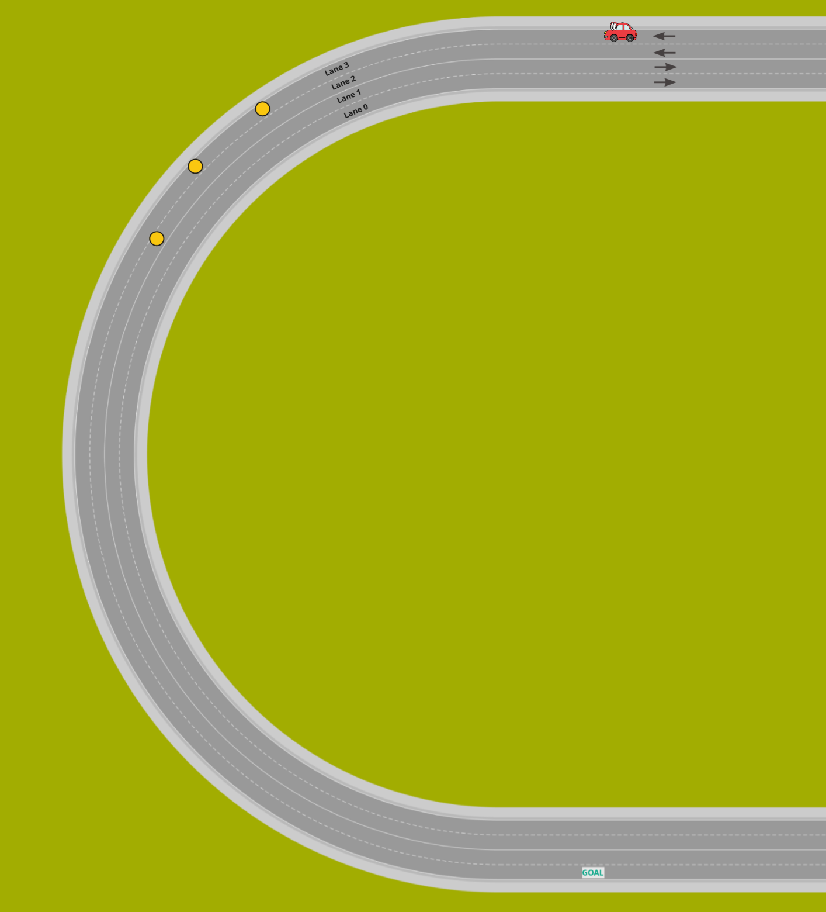

# Lane Planner Bringup

Collection of all configured launch files ready for simple execution. 

## Contributions to this Package

| Name          | Tasks                                                                                                                                                                                                        |
| ------------- | ------------------------------------------------------------------------------------------------------------------------------------------------------------------------------------------------------------ |
| Johann Erhard | <ul><li>Configure and maintain package structure</li><li>Create launch file structure ([demo_core](launch/demo_core.launch), [demo_visualizer](launch/demo_visualizer.launch)) using `timed_roslaunch` package</li></ul> |
| Chieh Lin     | <ul><li>Create Demo configurations `demo<i>.launch`</li><li>Document Demo configurations</li></ul>                                                                                                           |

## Demo Core

The core launch file `demo_core` consists of all important launch steps of our simulation. This file can be launched on its own for testing purposes without any simulation. Each `demo<i>.launch` file is configured to launch an individual demonstration as seen below.

* For testing purposes without simulation:
```shell
roslaunch lane_planner_bringup demo_core.launch
```

## Demo 1
### Launch:
```
roslaunch lane_planner_bringup demo1.launch
```
### Description:
Spawning one static obstacle on lane 0

### Visualisation:


## Demo 2
### Launch:
```shell
roslaunch lane_planner_bringup demo2.launch
```
### Description:
Spawning one static obstacle on lane 0 and one static obstacle on lane 1

### Visualisation:


## Demo 3
### Launch:
```
roslaunch lane_planner_bringup demo3.launch
```
### Description:
Spawning two static obstacles on lane 0 and one static obstacle on lane 1

### Visualisation:


## Demo 4
### Launch:
```
roslaunch lane_planner_bringup demo4.launch
```
### Description:
Spawning one dynamic obstacle(in correct direction) on each lane

### Visualisation:


## Demo 5
### Launch:
```
roslaunch lane_planner_bringup demo5.launch
```
### Description:
Spawning one dynamic obstacle(in false direction) on lane 0

### Visualisation:


## Demo 6
### Launch:
```
roslaunch lane_planner_bringup demo6.launch
```
### Description:
Spawning one dynamic obstacle(in false direction) on lane 0 and one dynamic obstacle(in correct direction) on lane 1/2/3

### Visualisation:


## Demo 7
### Launch:
```
roslaunch lane_planner_bringup demo7.launch
```
### Description:
Spawning eight static obstacles for right curved road

### Visualisation:


## Demo 8
### Launch:
```
roslaunch lane_planner_bringup demo8.launch
```
### Description:
Spawning three static obstacles for left curved road

### Visualisation:

