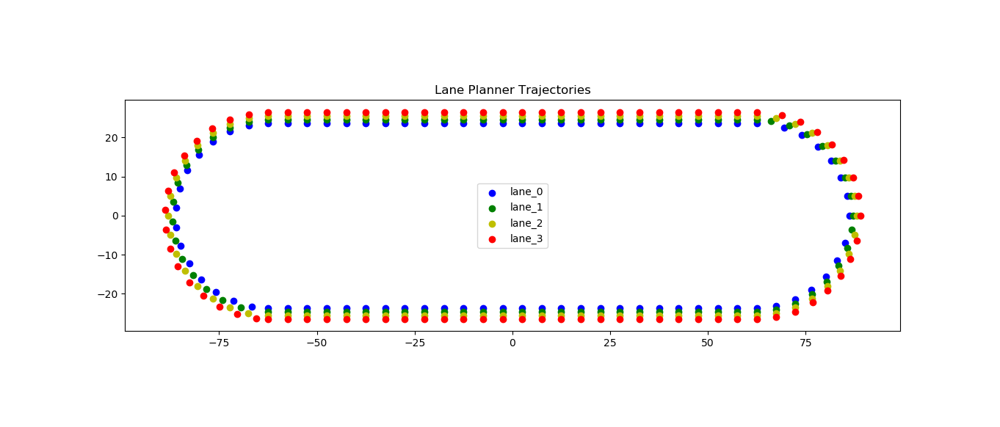

# Lane Planner Environment

## Contributions to this Package

| Name     | Tasks                 |
| -------- | --------------------- |
| Fabian Zillenbiller | <ul><li>Create [Gazebo World Generator](../lane_planner_helpers/highway_generator)</li><li>Create [Trajectory Generator](scripts/generate_trajectories.py) that fit the gazebo environment</li><li>Configure launch files for **SLAM and Navigation** pipeline: [environment.launch](launch/environment.launch), [navigation.launch](launch/navigation.launch)</li><li>Generate map and configure [map_server](launch/config/map_server)</li></ul> |
| Chieh Lin |  <ul><li>Create [Obstacle Generator](scripts/obstacles_generator.py) for dynamic and static obstacles</li><li>Create obstacle simulation for each individual **demonstration mode**</li><li>Configure launch files for simulation: [simulation.launch](launch/simulation.launch)</li></ul> |

## Generate Trajectories

The node `generate_trajectories.py` generates a `.yaml` file with the lane trajectories. Choose the same highway parameters as in [highway_generator](highway_generator).


* Generate without plot:

```shell
rosrun lane_planner_environment generate_trajectories.py
```

* Generate with plot:

```shell
rosrun lane_planner_environment generate_trajectories.py --plot
```



## Navigation 

For the navigation stack we use an adapted TAS software stack.

In `navigation.launch`, we copied the original `slam.launch` with adapted parameters:

- For the hector_mapping, we changed the map parameters and and also adapted the relevant update parameters.

- Also, we enabled `hector_mapping` and `AMCL` to use the merged laser scans.

The navigation map has been created by driving the car around and saving the created map. We then eliminated map noise with GIMP and correctly set the map's origin in its config file.

## Generate Obstacles

For generating obstacles, we have chosen two models of obstacles to implement in our project — A static obstacle (Box) and a dynamic obstacle (Pickup truck).
We spawn the obstacles via `gazebo/spawn_sdf_model`, according to the assigned trajectory points for each obstacle.

The user could decide how many obstacles to be spawned, and we randomly assigned each obstacle to each lane. Then we randomly choose a starting point from each lane and create a new trajectory array for each obstacle.

Lastly, for dynamic obstacles, we used `CatmullSpline.py` (included in our exercises) to provide a smooth transition throughout every trajectory point.


