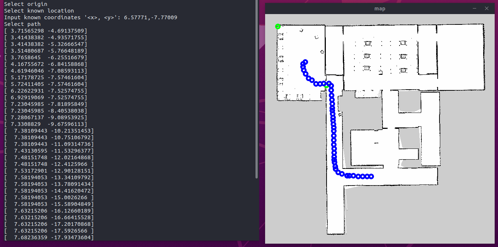

# Lane Planner Helpers

Collection of helper and simulation scripts for lane planner package.

## Python requirements

```shell
pip3 install -r requirements.txt
```

## Trajectory Intersection

Test and simulate possible trajectory intersection algorithms for [findNeighborTrajectories](../../lane_planner/src/lib/trajectory_helper.cpp#L168) function of **LaneGlobalPlanner plugin**. The algorithm for computing an intersection betwen two lines given two points each is applied. This algorithm is used to determine on which side of the robot a trajectory is located at. After determining the intersection between a perpendicular line to the robot's orientation and every trajectory, the distance and angle can be used to determine on which side of the robot the trajectory is located at. This is necessary because the original trajectory resolution is too low for other methods.

* Jupyter Notebook: [trajectory_intersection](trajectory_intersection.ipynb)

## Trajectory Interpolation

Test and simulate trajectory interpolation methods for [preparePlan](../../lane_planner/src/lib/trajectory_helper.cpp#L347) function of **LaneGlobalPlanner plugin**. The algorithm is used when creating a path between a start and goal position using given trajectory. Because the original trajectory resolution is very low, these methods are necessary to ensure a smooth reference for the MPC Planner to follow.

* Jupyter Notebook: [interpolation_methods](interpolation_methods.ipynb)

## Path Creator

Before the gazebo environment and the trajectories were generated by **lane_planner_environment** package, this tool was used to generate custom trajectories for a given map to debug the **LaneGlobalPlanner plugin**.

### Path Creator Usage

```shell
usage: path_creator.py [-h] -map MAP

optional arguments:
  -h, --help  show this help message and exit
  -map MAP    Path to map image
```

### Path Creator Demo

```shell
python3 path_creator.py -map map.png
```


