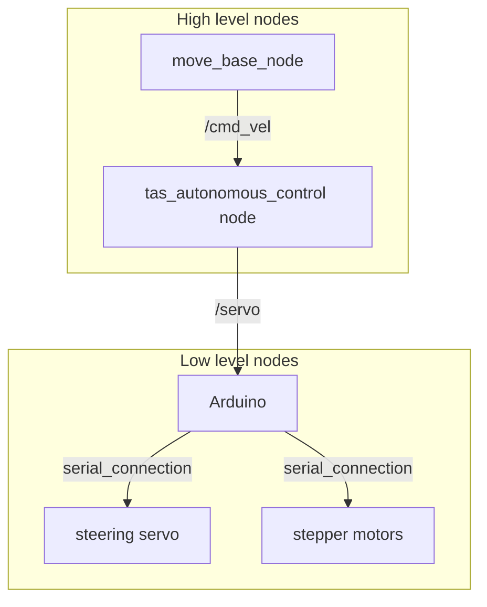
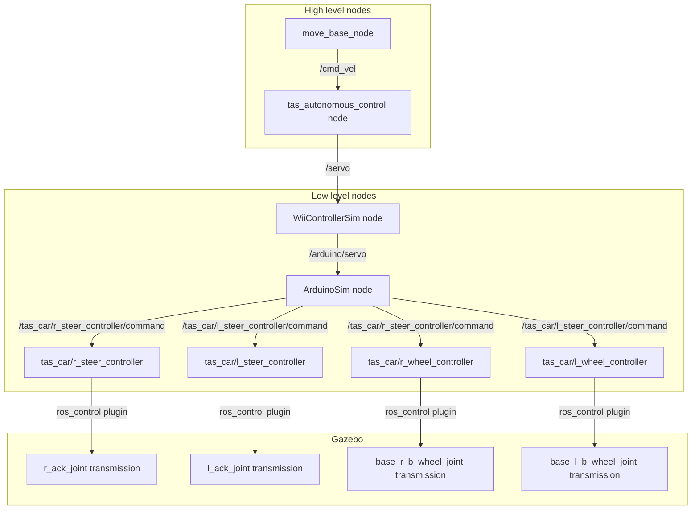

# TAS SIM package  
![alt text1][simulation]

[simulation]: img/tas_sim.jpg "Logo for the simulation"

The tas\_sim package can be used to test the high level functions of the car at home and develop your own functionalities
at home without having to use the TAS car in the lab.   


# Table of contents
- [TAS SIM package](#tas-sim-package)
- [Table of contents](#table-of-contents)
- [Introduction](#introduction)
- [Package description](#package-description)
  - [Usage](#usage)
  - [Car model](#car-model)
  - [World simulation](#world-simulation)
  - [Teleoperation](#teleoperation)
  - [Autonomous Mode](#autonomous-mode)
  - [Testing](#testing)
  - [Further configuration](#further-configuration)
  - [Using Hardware move_base Parameters](#Using-Hardware-move_base-Parameters)
- [Full simulation structure](#full-simulation-structure)
  - [Pipeline with tas\_autonomous\_control folder](#pipeline-with-tasautonomouscontrol-folder)
  - [Pipeline without tas\_autonomous\_control folder](#pipeline-without-tasautonomouscontrol-folder)
- [Run Simulation parallel to Hardware](#Run-Simulation-parallel-to-Hardware)
- [Code documentation](#code-documentation)
- [Bugs and issues](#bugs-and-issues)
  - [Gazebo crashes](#gazebo-crashes)
  - [Nodes don't do anything](#nodes-dont-do-anything)
  - [Message passing related issues](#message-passing-related-issues)
  - [Costmaps and settings differ from the real car](#costmaps-and-settings-differ-from-the-real-car)
  - [Model collapses into the simulation origin](#model-collapses-into-the-simulation-origin)
  - [Unable to set initial pose](#unable-to-set-initial-pose)
  - [Testing fails to generate valid plans](#testing-fails-to-generate-valid-plans)

# Introduction
The **_tas_sim_** package simulates the car for the lecture Technik autonomer Systeme. It uses [Gazebo](http://gazebosim.org/) with minimum version 11.0 and [ros_control](http://wiki.ros.org/ros_control) to enable remote testing and developing without lab access. 


# Package description

## Usage
The simulation was developed to be as close to the real car as possible. This is also reflected in structure of the launch files and their usage.  
To start the simulation with a spawned car, running low-level ROS controllers and the autonomous stack running, enter the following command into your console:
```console
user@user:~$ roslaunch tas_sim car.launch
```  
> **Note:** If this launch command sometimes crashes, just close and repeat until Gazebo comes up. Gazebo is not stable on startup, especially in older versions when used with ROS kinetic. For further information, see [Bugs and issues](#bugs-and-issues).  


![alt text2][simulation_screen]

[simulation_screen]: img/gazebo_screenshot.png "Screenshot of the running simulation"


Because the model lacks the low-level devices, it is also missing the remote controller to switch from autonomous mode to teleoperation mode. Therefore, an additional node has to be active to forward the commands to the car. To launch the virtual Wii controller, enter the following command into your console:
```console
user@user:~$ roslaunch tas_sim wii_control.launch
```
The controller will launch a dialogue with further instructions on how to use it. Alternatively, refer to [Teleoperation](#teleoperation) and [Autonomous Mode](#autonomous-mode) for additional information.

The simulation also features a complete test program with dynamic objects that move as the car drives towards its goal. The test is an easy way to check your planner configurations or additional capabilities for the car. The test registers start and goal pose automatically and moves human models around the basement. To start the test, enter the following command into your console:
```console
user@user:~$ roslaunch tas_sim test.launch
```
> **Note:** Keep in mind that you **always** need a Wii controller active that is set to autonomous mode if you want the car to accept autonomous commands, also during this test.

## Car model
The car model uses the meshfiles from the Solidworks model as base for the URDF structure. Because URDF does not support closed kinematic chains, the Ackermann structure of the model can't be maintained. Instead, the model uses dummy steering links.
The front wheels are unactuated, but the dummy links for steering are controlled by effort controllers with a joint position interface.
The rear wheels are actuated with effort controllers over a joint velocity interface. All four controllers' PID gains can be tuned by altering their values in their [config file](config/gazebo_controller.yaml).
> **Warning:** Be careful when tuning the controller values. Too high/low gains may lead to the collapse of the model. See [Bugs and issues](#bugs-and-issues).  

The model also includes two laser scanners, as well as an IMU. The laser scanners are publishing to different topics than the ones on real TAS car, namely */scan\_front* and */scan\_back*. The IMU model is not used by the tas stack at this moment and the sensor is not fully functional. Feel free to correctly implement the IMU in the model. Caution is advised with the inertias though, values are calculated based on the overall shape of the meshes and an estimate of their weight. Therefore the inertias might not reflect the robot particularly well.

The laser scanner sensors are configured in the [xacro macro file](urdf/tas_car_macros.xacro). If you want to test your car with larger sensor noise or different laser angle settings, you can do so by changing the respective values in the gazebo tag.

## World simulation
This package comes with a [custom Gazebo model base](gazebo/models/) and a [world file](gazebo/worlds/basement_ext.world) included. The world file is a 1:1 scale implementation of the N5 building basement where the TAS laboratory is located and most of the real testing is done as well. Although not a perfect representation, it works very well with the original basement map included in the package. Feel free to record your own map of the simulation world to further improve performance.
> **Note:** The chairs in the laboratory are placed at random every time you start up the simulation. This is meant to be a realistic environment for teams who want to develop an initial pose estimation algorithm.

The simulation works quite well for the car. Without the autonomous stack, a realtime factor of around 1 is achieved. With the full stack, performance drops to a realtime factor of about 0.5-0.65, meaning the simulation slows down to about half to two thirds speed. In case you want to test computationally intensive algorithms you might want to scale down the realtime factor yourself to something lower. You can change it by accessing the [world file](gazebo/worlds/basement_ext.world) and changing the following parameters
```xml
<physics name='default_physics' default='0' type='ode'>
    <max_step_size>0.001</max_step_size>
    <real_time_factor>1</real_time_factor>
    <real_time_update_rate>1000</real_time_update_rate>
</physics>
```
to something like this:
```xml
<physics name='default_physics' default='0' type='ode'>
    <max_step_size>0.001</max_step_size>
    <real_time_factor>0.25</real_time_factor>
    <real_time_update_rate>250</real_time_update_rate>
</physics>
```
## Teleoperation
To start teleoperation of the car, bring up the simulation with a spawned car, running ROS controllers and running low-level hardware emulators. The convenient way to do this is to launch:
```console
user@user:~$ roslaunch tas_sim car.launch
```
If you want as minimal software running as possible, launch:
```console
user@user:~$ roslaunch tas_sim basement.launch
user@user:~$ roslaunch tas_sim tas_car.launch
```
You can now control the car by launching the obligatory Wii controller
```console
user@user:~$ roslaunch tas_sim wii_control.launch
```
and press "Enter" twice. You will now see instructions on how to use the teleoperation node.  
Moving around:

|   |    |   |
| --- | --- | --- |
| u | i | o |
| j | k | l |
| m | , | . |

Each key is mapped to a fixed command reflecting its position in the key field. Pressing "Enter" or "Ctrl-C" will switch back to the autonomous node.  
> **Note:** The teleoperation mode is also used to stop the commands from the tas navigation stack. There is no third "passive" mode, just start the teleop mode without giving a speed command.

The teleop node is adapted from the original ROS teleop node. Further information on the teleop node can be found in this package's documentation or on the [original Github page](https://github.com/ros-teleop/teleop_twist_keyboard).

## Autonomous Mode
In autonomous mode, the commands from the tas navigation stack get forwarded to the low-level device emulators, which in turn publish to the car's ROS controllers. To run the autonomous mode, bring up the full simulation and start your Wii controller:
```console
user@user:~$ roslaunch tas_sim car.launch
user@user:~$ roslaunch tas_sim wii_control.launch
```
Set up your initial position and goal in RVIZ and press "Enter" on your Wii controller to enable the autonomous mode. You should see your car moving along the planned trajectory in Gazebo and in RVIZ.

## Testing
The package comes with an all-in-one launch file that enables testing the first task of driving from the lab to the stairs of the N5 basement with different parameter settings, special algorithms etc. To start the test, bring up the full simulation and launch the test:
```console
user@user:~$ roslaunch tas_sim car.launch
user@user:~$ roslaunch tas_sim wii_control.launch
user@user:~$ roslaunch tas_sim test.launch
```
> **Note:** Remember to set your Wii controller to autonomous mode!

The test script does basically everything for you. It sets up the cars initial position and its goal. As you might want to test your algorithms with moving objects around the car, the test node also spawns 3 human models inside the simulation. As soon as the car passes a trigger position along its path, the models start to move. You can add additional models in the [launch file](launch/test.launch). All objects are moved along trajectories defined by control points in the [trajectory config file](config/test_trajectories.yaml). The config file also requires the exact Gazebo object name. If you want to change the start, goal or trigger poses for the test, you can do so in the [test config file](config/test_config.yaml). Be careful with the reference frames, start and goal pose are given in the _map_ frame! You can also adjust the speed of trajectories by changing the trajectory_speed factor inside the config file.

> **Note:** Be sure to register any **new** objects in the trajectory config file!

For additional information, consult the [**test_sim.py** file documentation](doc/html/).
## Further configuration
All configurations that are done in the [tas/launch/config folder](../tas/launch/config/) are also present [within the tas_sim launch folder](launch/config). Some configurations are changed, namely the robot base frame for the [global_costmap_params.yaml](launch/config/move_base/global_costmap_params.yaml) and the [local_costmap_params.yaml](launch/config/move_base/local_costmap_params.yaml). 
> **Warning:** This frame naming change is necessary, do not try to change the name in the URDF. This will lead to errors with AMCL!

Please be aware that the tas\_sim package uses its own settings in tas\_sim/launch/config, in order to test different parameters during simulation without affecting your hardware settings and to avoid any confusion about what values are changed in which package.

There is also a [map](launch/config/map_server/simMap.yaml) made in the simulation that includes rooms not present in the normal map. You can reconfigure your map server to use this map. If you configure your map server to use the available simulation map, be sure to also change the initial test pose and goal pose accordingly in the config files!

## Using Hardware move_base Parameters
In case you want to launch the simulation with the move_base parameters that are set for the real car you can launch:
```console
user@user:~$ roslaunch tas_sim car_HW_params.launch
```
This launches the move_base.launch file that gets the costmap and planner parameters in tas\_operation/launch/config
# Full simulation structure
The following two sections explain the different pipelines for the simulation, one with the tas\_autonomous\_mode installed, one without it. Reasons to remove the folder are given in the [second section](#pipeline-without-tas_autonomous_control-folder).
## Pipeline with tas\_autonomous\_control folder
To understand the structure of the simulation and the tas stack in general, it is really helpful to visualize their respective command pipelines. You can also use these graphs if you experience any weird behavior with the simulation. This is the normal tas car pipeline:

The simulation pipeline is more complex than the real one. Don't let this discourage you. It differs from the real car only from the message processing in the lower level nodes. The ROS interface for high level nodes to the car remains the same up until the publishing of the _/servo_ topic. 

As you can see, because there is no Arduino to receive the _/servo_ messages from the **tas\_autonomous\_control\_node**, they get forwarded to the **ArduinoSim** node instead. To maintain control over the activation of the autonomous mode, the **WiiControllerSim** node acts as a middle man that discards the _/servo_ commands whenever autonomous mode is deactivated, and can send his own commands to _/arduino/servo_ instead. If forwarded towards the **ArduinoSim** node, the _/servo_ messages get decoded and transformed back into a desired car speed and steering angle. The **ArduinoSim** node then transforms these commands into steering commands for the individual controllers according to a geometric Ackermann model and publishes them. The ROS controllers then actuate the actual joints in the simulation over a **_ros\_control_** gazebo plugin. 
> **Note:** It might seem easier to take the _/vel\_cmd_ command instead of encoding it in the **tas\_autonomous\_control\_node** and decoding it back in the **ArduinoSim** node. However, this structure keeps the topic pipeline as close as possible to the real car so students don't have to further adapt their algorithms for use in the simulation. 

>**Warning:** Because the low-level devices are not present in Gazebo, there is no way to simulate improvements on the servo or the Arduino codes. If you want to work on those, you **can not use this simulation**.

## Pipeline without tas\_autonomous\_control folder
On some machines, the full tas stack will not compile with catkin_make because of a supposedly missing header file (control.h), even when it is added manually. To avoid not being able to compile any nodes, you may want to delete your **_Arduino_** and **_tas\_autonomous\_control_** folder. This interrupts the control message pipeline from the previous section at the connection from high to low level nodes. To maintain the control flow, the [**_autonomous\_node\_sim_**](src/tas_sim/AutonomousNodeSim.py) node with the same functionality as the **tas\_autonomous\_control\_node** is included in the **_tas\_sim_** package. It will automatically launch if ROS detects that the **tas\_autonomous\_control\_node** node is missing upon simulation startup. This changes the pipeline to the following:


Again, the structure is chosen to keep the pipeline as close to the real car as possible. 
> **Note:** Should you experience a loss of _/servo_ commands, please make sure the alternative **autonomous\_node\_sim** is running!
# Run Simulation parallel to Hardware
The simulation package includes a node that subscribes to the amcl_pose topic of the real car, transforms the position and orientation into the Gazebo coordinate frame and publishes to the set\_model\_state topic of Gazebo.
In this case Gazebo poses as an visualisation tool only.
To start the visualisation, enter the following command into your console after you launched the real car normally:
```console
user@user:~$ roslaunch tas_sim GazeboVis.launch
```
> **Note:** Do not run this when simulating the car. Only when operating with the real car. 
# Code documentation
All the code in this package is documented with _rosdoc_lite_, which uses doxygen as external documentation tool.  
It includes descriptions of all classes, functions and variables, as well as important notes on their use.  
The documentation can be found [here](doc/html/) by calling:  
```console
user@user:~$ firefox index.html
```

The URDF files are commented to no particular standard, but should be pretty self explanatory. The same goes for all YAML configuration files and launch files.

# Bugs and issues
The following section lists some known bugs and possible issues with the simulation and tries to resolve them. If you feel like you have **thoroughly and extensively** searched for a solution on stackoverflow, the ROS and gazebo forums and asked your tutor without results, again feel free to reach out via forum or contact TAS management team.

## Gazebo crashes
Right up front: Gazebo crashes during startup are not an unusual thing, but they can be dealt with.
There two very common crash causes:
> X Error of failed request: BadDrawable...

This is probably an error with you graphics rendering. To get the best performance, please consider [installing the proprietary NVIDIA drivers](https://www.cyberciti.biz/faq/ubuntu-linux-install-nvidia-driver-latest-proprietary-driver/) on your machine instead of the open source default drivers **if you own a NVIDIA card**. More information on this error can be found [here](http://answers.gazebosim.org/question/3703/baddrawable-error-on-first-run-of-gzserver-after-install/).
The second one is also probably related to your graphics card or drivers.
> Segmentation fault

If you experience any of those two, you can also just restart the simulation. You might need a few trys, more than 4-5 times should be considered very unusual however. It is strongly advised to try the NVIDIA drivers if you have an NVIDIA card though, as they really make a difference in stability!

If you experience an error similar to this, you most certainly have malformed meshes/models in your simulation:
> gzclient: /build/ogre-1.9-B6QkmW/ogre-1.9-1.9.0+dfsg1/OgreMain/include/OgreAxisAlignedBox.h:252: void Ogre::AxisAlignedBox::setExtents(const Ogre::Vector3&, const Ogre::Vector3&): Assertion (min.x <= max.x && min.y <= max.y && min.z <= max.z) && "The minimum corner of the box must be less than or equal to maximum corner" failed

Please remove any added custom models and restart the simulation.

> **Note:** Gazebo takes some time to shut down with "Ctrl-C". You can safely speed this up by entering the following command: 
```console
user@user:~$ pkill -9 gzserver
```

## Nodes don't do anything
Many nodes rely on the ROS /clock topic. If the ROS parameter _/use\_sim\_time_ is set to **False**, then many nodes will act as if no time is currently passing. Please make sure in this case that nothing overwrites the _/use\_sim\_time_ parameter!

## Message passing related issues
If you have removed the **tas\_autonomous\_control** folder for reasons explained in the [simulation structure section](#pipeline-without-tas_autonomous_control-folder), any issues related to a missing _/servo_ command are related to the [**_autonomous\_node\_sim_**](src/tas_sim/AutonomousNodeSim.py). If the _/arduino/servo_ command isn't published, please check if your [**_WiiControllerSim_**](src/tas_sim/WiiControllerSim.py) node is running and **set to autonomous mode**. For any problems with the ROS control topics, please refer to the documentation and source of the [**_ArduinoSim_**](src/tas_sim/ArduinoSim.py) node.

In general, please always check your rqt_graph for information on the nodes and compare the message flow to the graphs [above](#full-simulation-structure).
```console
user@user:~$ rosrun rqt_graph rqt_graph
```
Also, each time you restart your simulation, it is advised to also restart the **WiiControllerSim** node. ROS may not forward the messages to the node otherwise.

## Costmaps and settings differ from the real car
As explained in the [configuration section](#further-configuration), you have to exactly mirror your settings for the global and local costmap inside the [tas\_sim/launch/config/move_base](launch/config/move_base/) folder. Most of your problems should be related to this.

## Model collapses into the simulation origin
This bug occures if you choose unfitting PID values for the controllers in their [config file](config/gazebo_controller.yaml), so that the combination of model inertia and excerted forces brings the physics engine to its knees. Please reset the parameters to their default values and undo any model inertia changes that you made. 

## Unable to set initial pose
Please make sure you have specified the correct laserscan topics in the [amcl launch file](launch/move_base.launch) and the [hector\_mapping launch file](launch/odom.launch), as well as the [planner configuration files](launch/config/move_base/).

If you do and the problem persists, please make sure the robot\_reference\_frame in the planner config files is still set to **base\_footprint** and the root link of the robot in the [robot model files](urdf/tas_car.urdf.xacro) is still named **base\_footprint**.

## Testing fails to generate valid plans
Did you change your map to the simulation map? If yes, please check if your test config files are set to their correct initial pose and goal pose. The map origins of the two maps are not aligned, which is why you have to reconfigure your test after a map change.

## Thanks
This package is developed by TAS course student. It was iteratively changed by student assistants and students participating in TAS course and PP course. Special thanks to Martin, Dominik, Jiangnan, Adrian, Luis and Lukas.
